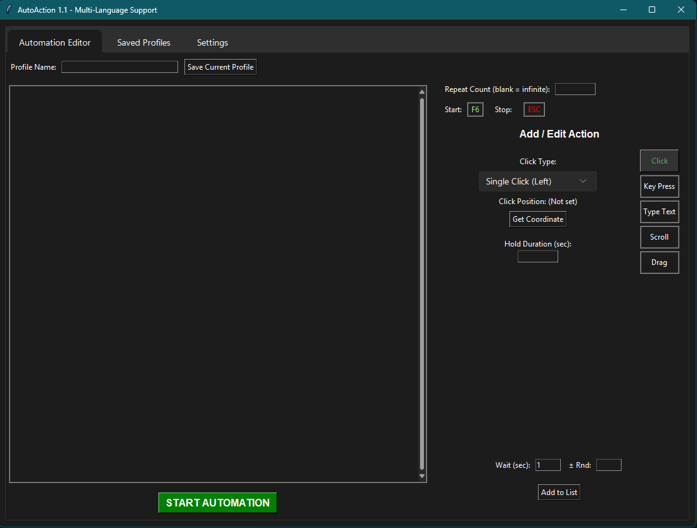

# OtoEylem v1.1

A versatile Windows macro/auto-clicker application to record and automate user actions. This application was developed with the assistance of Gemini AI.

**[Türkçe Açıklama İçin Aşağı Kaydırın](#türkçe-açıklama)**


*(The image above shows the application in dark mode. It also supports a light theme.)*

## Features

*   **Multi-Action Support:** Mouse clicks (left, right, middle, double), key presses, text typing, scrolling, and dragging.
*   **Advanced Control:** Add custom wait times, hold durations, and random delays to each action.
*   **Loop Management:** Run action lists for a specific number of times or in an infinite loop.
*   **Save & Load:** Save your automation profiles and reuse them later.
*   **Modern UI:** Features both Light and Dark themes.
*   **Multi-Language:** Supports Turkish and English.
*   **Global Hotkeys:** Control the automation even when the program is in the background with global hotkeys (Default: F6 to Start, ESC to Stop).

## How to Download

To download the latest runnable `.exe` version, please visit the **[Releases](link_gelecek)** section on the right side of this page.

## License

This project is licensed under the [MIT License](LICENSE).

---

## Türkçe Açıklama

Kullanıcı eylemlerini kaydedip otomatikleştiren, gelişmiş özelliklere sahip bir Windows makro/otomatik tıklayıcı uygulamasıdır. Bu uygulama, Gemini AI yardımıyla geliştirilmiştir.

## Özellikler

*   **Çoklu Eylem Desteği:** Fare tıklamaları (sol, sağ, orta, çift), tuş basımları, yazı yazma, kaydırma ve sürükleme.
*   **Gelişmiş Kontrol:** Her eylem için özel bekleme süresi, basılı tutma süresi ve rastgele gecikme ekleme.
*   **Döngü Yönetimi:** Eylem listelerini belirli sayıda veya sonsuz döngüde çalıştırma.
*   **Kayıt ve Yükleme:** Oluşturduğunuz otomasyon profillerini kaydedip daha sonra tekrar kullanma.
*   **Modern Arayüz:** Açık ve Koyu tema desteği.
*   **Çoklu Dil:** Türkçe ve İngilizce dil desteği.
*   **Global Kısayollar:** Program arka plandayken bile atanan kısayol tuşlarıyla (varsayılan: F6 Başlat, ESC Durdur) otomasyonu kontrol etme.

## Nasıl İndirilir?

Programın en güncel, çalıştırılabilir `.exe` versiyonunu indirmek için bu sayfanın sağ tarafındaki **[Releases](link/gelecek)** bölümünü ziyaret edebilirsiniz.

## Lisans

Bu proje, [MIT Lisansı](LICENSE) altında lisanslanmıştır.```
